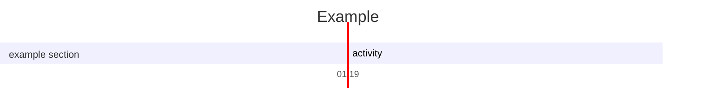
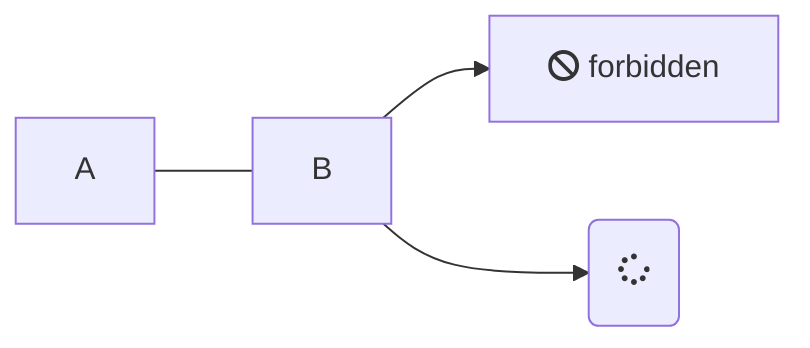

# Headline

> An awesome project. $h=\frac{5}{32^2}$

$$E=mc^6$$

$$x=uofjei$$

[必须柚子啊](test.md)
[ha](ni.md)

# FAQ Section

- ofpeopfe +


jfoiejoife

###### j +
fefe


fe
few
fwef
wefwe
f
wef
we

###### fejifeji

<li> fefe + </li>

#### fefe

Introduction text for the FAQ page.

- • An intersection formula for Lubin--Tate spaces (With [ansn](qirui.li)) +

  Answer 1 [dfde](qirui.li)</br> fejijfei ia

  fefeji

---- published at: Duck


+ An tjerijei +

 feji
Available on Arxiv


- Anintersection number formuls ofjeio
+ Author:Qirui LiAbstract:click for details +

 We have do what to do

+ Question 2? +

  Answer 2

+ Question +

 hahahah


+ Question +

yayaya
$$
\gdef\oo{\mathcal O_F}
$$


$$
\oo\oo\oo
$$

$f
$

$$
3^σ
$$

$$
\begin{CD}
A@>>>B\\
\end{CD}
$$

$$\eqalign{
(a-b)^2 &= (a-b)(a-b) \\
        &= a^2 - ab - ba + b^2 \\
        &= a^2 - 2ab + b^2
}$$

$$
{x \over y}
$$

$$
\frac xy
$$

$$
x \over { y\over z}+1
$$

$$
\pmatrix{1&2\\4&4}
$$

$$
∑_{n=1}
$$

$$
\sum_{n=1}
$$



``` sequence-diagrams
Andrew->China: Says
Note right of China: China thinks\nabout it
China-->Andrew: How are you?
Andrew->>China: I am good thanks!
```

``` plantuml
Bob -> Alice : hello
```

@startuml
Bob -> Alice : hello
@enduml





``` flowchart
st=>start: Start|past:>http://www.google.com[blank]
e=>end: End|future:>http://www.google.com
op1=>operation: My Operation|past
op2=>operation: Stuff|current
sub1=>subroutine: My Subroutine|invalid
cond=>condition: Yes
or No?|approved:>http://www.google.com
c2=>condition: Good idea|rejected
io=>inputoutput: catch something...|future

st->op1(right)->cond
cond(yes, right)->c2
cond(no)->sub1(left)->op1
c2(yes)->io->e
c2(no)->op2->e
```


``` chart
{
  "type": "pie",
  "data": {
    "labels": [
      "Red",
      "Blue",
      "Yellow"
    ],
    "datasets": [
      {
        "data": [
          300,
          50,
          100
        ],
        "backgroundColor": [
          "#FF6384",
          "#36A2EB",
          "#FFCE56"
        ],
        "hoverBackgroundColor": [
          "#FF6384",
          "#36A2EB",
          "#FFCE56"
        ]
      }
    ]
  },
  "options": {}
}
```

