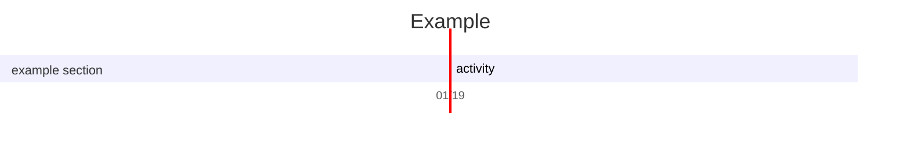
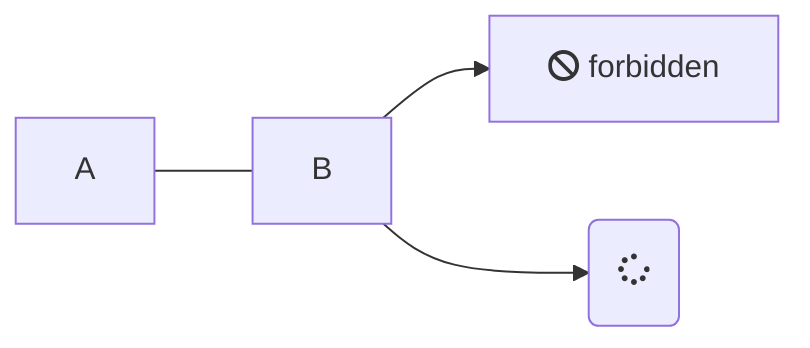

# Futher functions that could added to the blog

- Question: Click here to open it +

  Answer: Here is an example of folded question


+ Question +

 Answer

The latex support Unicode input such as the following
$$
3^σ
$$
It also supports latex diagram 
$$
\begin{CD}
A@>>>B\\
\end{CD}
$$

To align equations
$$\eqalign{
(a-b)^2 &= (a-b)(a-b) \\
        &= a^2 - ab - ba + b^2 \\
        &= a^2 - 2ab + b^2
}$$

Here is an example of matrix input
$$
\pmatrix{1&2\\4&4}
$$





``` plantuml
Bob -> Alice : hello
```

@startuml
Bob -> Alice : hello
@enduml





