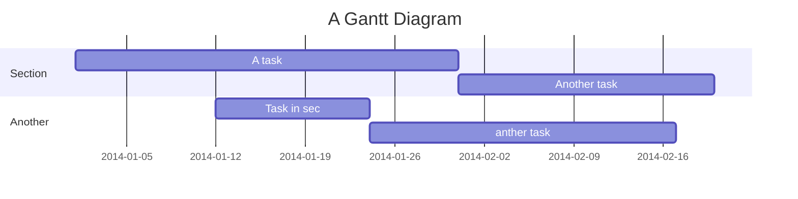

[Return to the original note](README.md)

You can look at [Markdown Basic Syntax](https://www.markdownguide.org/basic-syntax/) to learn more.

## Header link
Every header will automatically add a url link on the left side.
You can hover and click <i class="octicon octicon-link"></i> to anchor on it.

Edit:
===

## Title:
This will take the first **level 1 header** as the note title.

## Tags:
Using tags as follows, the specified tags will show in your note list.
###### tags: `features` `cool` `updated`

## Emoji
You can type any emoji like this :smile: :smiley: :cry: :wink:
> See full emoji list [here](https://github.com/ikatyang/emoji-cheat-sheet).

## ToDo List:
- [ ] ToDos
  - [x] Buy some salad
  - [ ] Brush teeth
  - [x] Drink some water

## Code Block:
We support many programming languages, use the auto complete function to see the entire list.
```javascript=
var s = "JavaScript syntax highlighting";
alert(s);
function $initHighlight(block, cls) {
  try {
    if (cls.search(/\bno\-highlight\b/) != -1)
      return process(block, true, 0x0F) +
             ' class=""';
  } catch (e) {
    /* handle exception */
  }
  for (var i = 0 / 2; i < classes.length; i++) {
    if (checkCondition(classes[i]) === undefined)
      return /\d+[\s/]/g;
  }
}
```
> If you want **line numbers**, type `=` after specifying the code block languages.
> Also, you can specify the start line number.
> Like below, the line number starts from 101:
```javascript=101
var s = "JavaScript syntax highlighting";
alert(s);
function $initHighlight(block, cls) {
  try {
    if (cls.search(/\bno\-highlight\b/) != -1)
      return process(block, true, 0x0F) +
             ' class=""';
  } catch (e) {
    /* handle exception */
  }
  for (var i = 0 / 2; i < classes.length; i++) {
    if (checkCondition(classes[i]) === undefined)
      return /\d+[\s/]/g;
  }
}
```

> Or you might want to continue the previous code block's line number, use `=+`

```javascript=+
var s = "JavaScript syntax highlighting";
alert(s);
```

> Sometimes you have a super long text without breaks. It's time to use `!` to wrap your code.

```!
When you’re a carpenter making a beautiful chest of drawers, you’re not going to use a piece of plywood on the back.
```

### Blockquote Tags:
> Using the syntax below to specifiy your **name, time and color** to vary the blockquotes.
> [name=ChengHan Wu] [time=Sun, Jun 28, 2015 9:59 PM] [color=#907bf7]
> > Even support the nest blockquotes!
> > [name=ChengHan Wu] [time=Sun, Jun 28, 2015 10:00 PM] [color=red]

## MathJax

You can render *LaTeX* mathematical expressions using **MathJax**, as on [math.stackexchange.com](http://math.stackexchange.com/), except the space after the start `$` and the space before the end `$` are not allowed in the inline math:

The *Gamma function* satisfying $\Gamma(n) = (n-1)!\quad\forall n\in\mathbb N$ is via the Euler integral

For block level math, please give `$$` and a line break before and after your math formula:

$$
x = {-b \pm \sqrt{b^2-4ac} \over 2a}.
$$

$$
\Gamma(z) = \int_0^\infty t^{z-1}e^{-t}dt\,.
$$

> More information about **LaTeX** mathematical expressions [here](http://meta.math.stackexchange.com/questions/5020/mathjax-basic-tutorial-and-quick-reference).

## UML Diagrams


### Mermaid


### PlantUML

```plantuml
start
if (condition A) then (yes)
  :Text 1;
elseif (condition B) then (yes)
  :Text 2;
  stop
elseif (condition C) then (yes)
  :Text 3;
elseif (condition D) then (yes)
  :Text 4;
else (nothing)
  :Text else;
endif
stop
```

## Typography

### Headers

```
# h1 Heading
## h2 Heading
### h3 Heading
#### h4 Heading
##### h5 Heading
###### h6 Heading
```

### Horizontal Rules

___

---

***


### Typographic Replacements

Enable typographer option to see result.

(c) (C) (r) (R) (tm) (TM) (p) (P) +-

test.. test... test..... test?..... test!....

!!!!!! ???? ,,

Remarkable -- awesome

"Smartypants, double quotes"

'Smartypants, single quotes'

### Emphasis

**This is bold text**

__This is bold text__

*This is italic text*

_This is italic text_

~~Deleted text~~

lu~lala~


Subscript: H~2~O


### Blockquotes


> Blockquotes can also be nested...
>> ...by using additional greater-than signs right next to each other...
> > > ...or with spaces between arrows.


### Lists

#### Unordered

+ Create a list by starting a line with `+`, `-`, or `*`
+ Sub-lists are made by indenting 2 spaces:
  - Marker character change forces new list start:
    * Ac tristique libero volutpat at
    + Facilisis in pretium nisl aliquet
    - Nulla volutpat aliquam velit
+ Very easy!

#### Ordered

1. Lorem ipsum dolor sit amet
2. Consectetur adipiscing elit
3. Integer molestie lorem at massa
1. You can use sequential numbers...

---

1. ...or keep all the numbers as `1.`
1. feafw
2. 332
3. 242
4. 2552
1. e2

Start numbering with offset:

57. foo
1. bar

### Code

Inline `code`

Indented code

    // Some comments
    line 1 of code
    line 2 of code
    line 3 of code


Block code "fences"

```
Sample text here...
```

Syntax highlighting

```javascript
var foo = function (bar) {
  return bar++;
};

console.log(foo(5));
```

### Tables

| Option | Description |
| ------ | ----------- |
| data   | path to data files to supply the data that will be passed into templates. |
| engine | engine to be used for processing templates. Handlebars is the default. |
| ext    | extension to be used for dest files. |

Right aligned columns

| Option | Description |
| ------:| -----------:|
| data   | path to data files to supply the data that will be passed into templates. |
| engine | engine to be used for processing templates. Handlebars is the default. |
| ext    | extension to be used for dest files. |

Left aligned columns

| Option | Description |
|:------ |:----------- |
| data   | path to data files to supply the data that will be passed into templates. |
| engine | engine to be used for processing templates. Handlebars is the default. |
| ext    | extension to be used for dest files. |

Center aligned columns

| Option | Description |
|:------:|:-----------:|
| data   | path to data files to supply the data that will be passed into templates. |
| engine | engine to be used for processing templates. Handlebars is the default. |
| ext    | extension to be used for dest files. |


### Links
[link text](http://dev.nodeca.com)
[link with title](http://nodeca.github.io/pica/demo/ "title text!")
Autoconverted link https://github.com/nodeca/pica


### Images


Like links, Images also have a footnote style syntax
![Alt text][id]
With a reference later in the document defining the URL location:

[id]: https://octodex.github.com/images/dojocat.jpg  "The Dojocat"


Show the image with given size

### Footnotes

Footnote 1 link[^first].
Footnote 2 link[^second].
Inline footnote^[Text of inline footnote] definition.
Duplicated footnote reference[^second].

[^first]: Footnote **can have markup**
    and multiple paragraphs.
[^second]: Footnote text.

